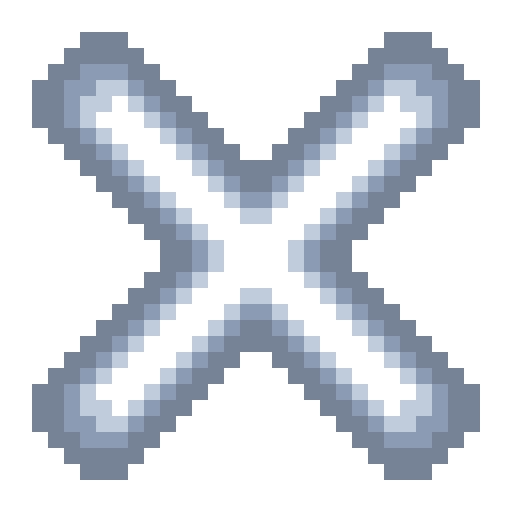

# TicTacElements
## About
### This is a simple 2 players tic tac toe game project for the órbi Web Games Developer bootcamp.
### You can choose you symbol (X or O) and this symbol can have one element. For each element there are different animations and sounds
### There are 4 elements: 
- Fire :fire:

  
  

 
 
  
- Water :droplet:

  
  

 
 
  
- Air :cloud:

  
  

 
 
  
- Earth :earth_americas:

  
  

 
 
